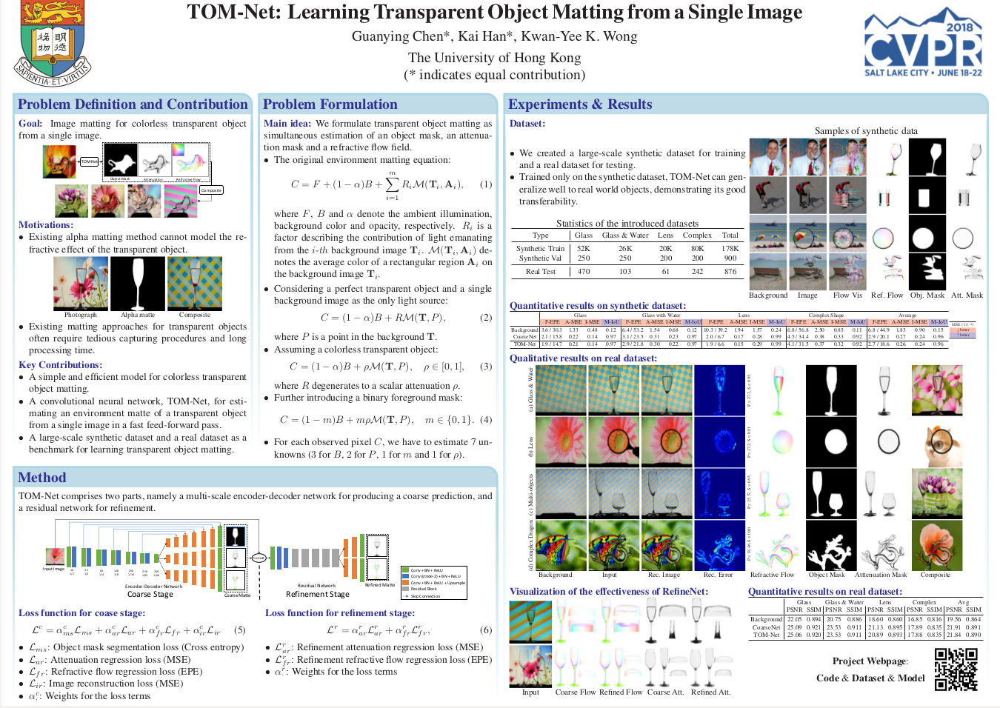

# LaTex Source for Speech2Action (CVPR 2020) Poster

      

## Introduction
LaTex source code for building the poster for Speech2Action (CVPR 2020) shown above. This poster is based on the amazing [LaTex Poster Template](http://www.brian-amberg.de/uni/poster/). Please refer to (http://www.brian-amberg.de/uni/poster/) for more examples and FAQ.
